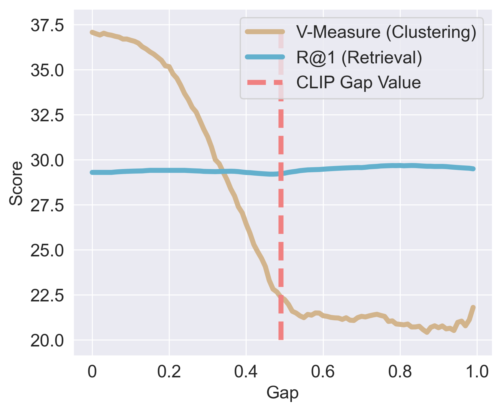

# [ICLR2026] Closing the Modality Gap Aligns Group-Wise Semantics
### [Eleonora Grassucci*](https://sites.google.com/uniroma1.it/eleonoragrassucci/home-page), [Giordano Cicchetti*](https://giordano-cicchetti.github.io/), Emanuele Frasca, Aurelio Uncini, [Danilo Comminiello](https://sites.google.com/uniroma1.it/danilocomminiello/home)

[[Paper on OpenReview](https://openreview.net/forum?id=RHPqr2egJO&noteId=5FxEvNaVoI)][[Project Page](https://ispamm.github.io/ModGap_page/)]

\* Eleonora & Giordano contributed equally to this work 🫂


### 💡 Intuition
The modality gap is irrelevant for instance-wise tasks, such as retrieval, which depend on relative rankings, but strongly impacts multimodal group-wise tasks, such as clustering, which rely on absolute distances among representations of multimodal data in the latent space. Closing the modality gap reduces the within-group scatter, leading to more coherent semantic groupings and better clustering performance, while leaving retrieval rankings mostly unaffected.

<center>
 
</center>

### 📉 Loss functions

To close the gap, we propose a combination of losses, coded as:

```python
def compute_centroids_only(text_embeddings, visual_embeddings):
    """
    Computes the centroid for each pair of samples between text embeddings and visual embeddings
    by calculating the mean of the corresponding feature vectors across the two modalities.

    Parameters:
    - text_embeddings (torch.Tensor): Tensor of shape (batch_size1, feature_dim) representing text embeddings.
    - visual_embeddings (torch.Tensor): Tensor of shape (batch_size2, feature_dim) representing visual embeddings.

    Returns:
    - torch.Tensor: Tensor of shape (batch_size1, batch_size2, feature_dim) representing the centroid for each pair.
    """

    # Compute centroids by averaging text and visual embeddings
    centroids = (text_embeddings + visual_embeddings) / 2.0

    return  centroids

def lalign_loss(x, y, alpha=2):
    return (x - y).norm(dim=1).pow(alpha).mean()

def lunif_loss(x, t=2):
    # Compute pairwise distances between all embeddings
    sq_pdist = torch.pdist(x, p=2).pow(2)
    
    # Apply the uniformity loss formula
    return sq_pdist.mul(-t).exp().mean().log()


# in the training loop, after computing the image and text embeddings:
# ...
anchor = contrastive_loss(image_embeds, text_embeds, temperature=temperature) 

centroids = compute_centroids_only(image_embeds, text_embeds)
centroids = F.normalize(centroids, dim=-1)
lunif_centroids = lunif_loss(centroids)
                        
lalign = lalign_loss(image_embeds, text_embeds)
loss =  anchor + config["lambda1"] * lalign + config["lambda2"] * lunif_centroids
# ...
```

### 📎 Instructions

Configure your `config.yaml` file, then run:

```bash
python main.py --device 0 --config config.yaml
```

Please note that the code provided is built to run two-modal experiments, with baseline model RN50 from openclip.

To run more extensive experiments, select the ViT described in the paper.

To run three-modal experiments, follow experimental description in the paper and download MSR-VTT. Loader for MSR-VTT can be grabbed from the [GRAM repository](https://github.com/ispamm/GRAM).

#### Citations
```
@inproceedings{grassucci2026closing,
title={Closing the Modality Gap Aligns Group-Wise Semantics},
author={Eleonora Grassucci and Giordano Cicchetti and Emanuele Frasca and Aurelio Uncini and Danilo Comminiello},
booktitle={The Fourteenth International Conference on Learning Representations (ICLR)},
year={2026},
}
```
